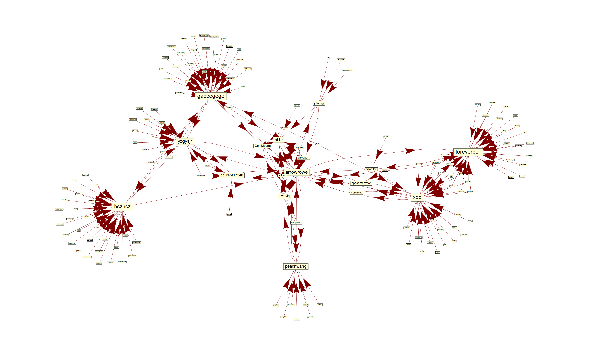

# Github Relationship

Visualize your GitHub relationship using [GitHub API v3](https://developer.github.com/v3/) in various languages.

**Note:** API rate limit is easily exceeded.

Inspired by [gaocegege/scala-github-relationship](https://github.com/gaocegege/scala-github-relationship).

## Mathematica

[Sample code](github-relationship.nb) and sample output:

## Scala

See [gaocegege/scala-github-relationship](https://github.com/gaocegege/scala-github-relationship). Sample output:

## Contribution

Feel free to send a pull request or open issues.
